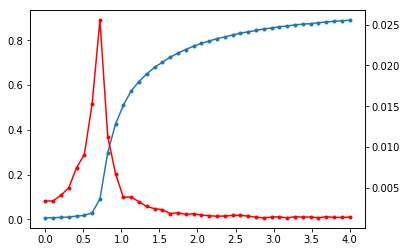

#  
# Structure and Dynamics on Graphs (Beta)

stDoG is a Tensorflow Python module for efficiently simulating phase oscillators (the Kuramoto model) on large heterogeneous networks. It provides an implementation for integrating differential equations using TensorFlow, making simulations suitable to be performed on GPUs.

## 1 - Install

```
pip install stdog
```
[stdogpkg/cukuramoto](https://github.com/stdogpkg/cukuramoto)
```
pip install cukuramoto
```

## 2 - Examples

### 2.1 - Dynamics

#### 2.1.1 - Kuramoto

##### Tensorflow
```python
import numpy as np
import igraph as ig
from stdog.utils.misc import ig2sparse  #Function to convert igraph format to sparse matrix


num_couplings = 40
N = 20480

G = ig.Graph.Erdos_Renyi(N, 3/N)
adj = ig2sparse(G)

omegas = np.random.normal(size= N).astype("float32")
couplings = np.linspace(0.0,4.,num_couplings)
phases =  np.array([
    np.random.uniform(-np.pi,np.pi,N)
    for i_l in range(num_couplings)

],dtype=np.float32)


precision =32

dt = 0.01
num_temps = 50000
total_time = dt*num_temps
total_time_transient = total_time
transient = False
```

```python
from stdog.dynamics.kuramoto import Heuns

heuns_0 = Heuns(adj, phases, omegas, couplings, total_time, dt,         
    device="/gpu:0", # or /cpu:
    precision=precision, transient=transient)

heuns_0.run()
heuns_0.transient = True
heuns_0.total_time = total_time_transient
heuns_0.run()
order_parameter_list = heuns_0.order_parameter_list # (num_couplings, total_time//dt)
```
```python
import matplotlib.pyplot as plt

r = np.mean(order_parameter_list, axis=1)
stdr = np.std(order_parameter_list, axis=1)

plt.ion()
fig, ax1 = plt.subplots()
ax1.plot(couplings,r,'.-')
ax2 = ax1.twinx()
ax2.plot(couplings,stdr,'r.-')
plt.show()
```


#### CUDA - Faster than Tensorflow implementation


```python
from stdog.dynamics.kuramoto.cuheuns import CUHeuns as cuHeuns

heuns_0 = cuHeuns(adj, phases, omegas,  couplings,
    total_time, dt, block_size = 1024, transient = False)

heuns_0.run()

heuns_0.transient = True
heuns_0.total_time = total_time_transient
heuns_0.run()
order_parameter_list = heuns_0.order_parameter_list #
```

## 3 - How to cite

[Thomas Peron](https://tkdmperon.github.io/), [Bruno Messias](http://brunomessias.com/), Angélica S. Mata, [Francisco A. Rodrigues](http://conteudo.icmc.usp.br/pessoas/francisco/), and [Yamir Moreno](http://cosnet.bifi.es/people/yamir-moreno/). On the onset of synchronization of Kuramoto oscillators in scale-free networks. [arXiv:1905.02256](https://arxiv.org/abs/1905.02256) (2019).

## 4 - Acknowledgements

This work has been supported also by FAPESP grants  11/50761-2  and  2015/22308-2.   Research  carriedout using the computational resources of the Center forMathematical  Sciences  Applied  to  Industry  (CeMEAI)funded by FAPESP (grant 2013/07375-0).
 
### Responsible authors

[@devmessias](https://github.com/devmessias), [@tkdmperon](https://github.com/tkdmperon)
